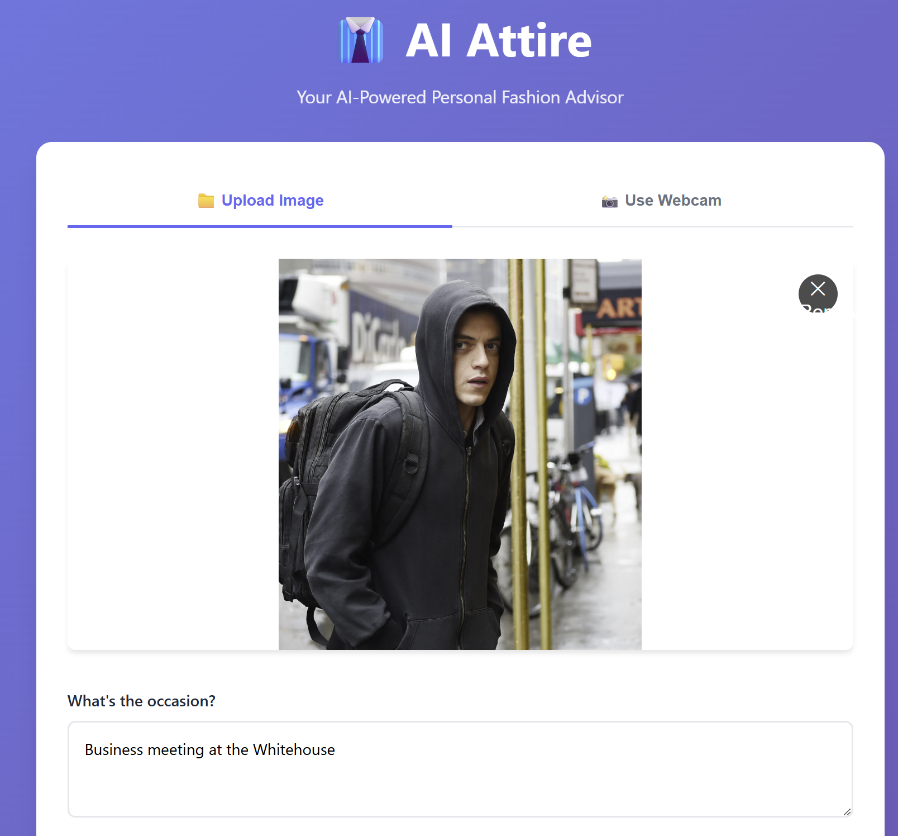
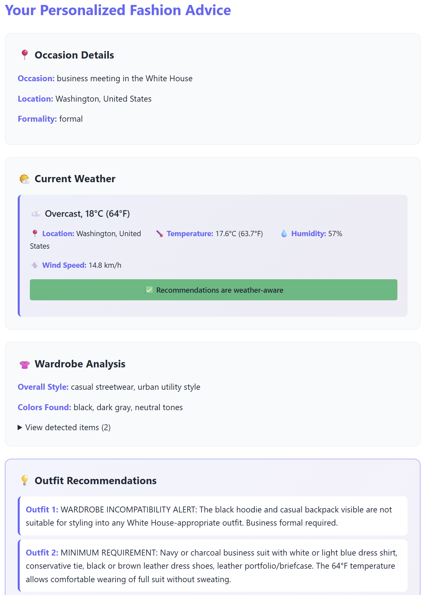

# 👔 ai-attire

> **AI-powered Personal Fashion Advisor** – Upload your wardrobe photo, describe your occasion, get personalized outfit recommendations powered by Claude AI

[](.)
[](LICENSE)
[](https://nodejs.org/)
[](.)
[](.)

---

### 🚀 Project Highlights

- ✅ **Complete & Production-Ready** - All 5 modules implemented and integrated end-to-end
- 📊 **Fully Tested** - 128 unit tests passing, 100% TypeScript strict mode
- 🏗️ **Modular Architecture** - Designed for parallel development with 5 independent, testable modules
- 🎯 **AI-Powered** - Leverages Claude's vision and language models for intelligent fashion advice
- 🌍 **Cultural Intelligence** - Location-specific recommendations and etiquette tips
- 💻 **Full-Stack** - Modern backend API (Express.js) + responsive web UI
- ⚡ **Production Ready** - Comprehensive error handling, input validation, rate limiting support

**Built for**: Vanderbilt Claude Builder Hackathon | **Scope**: 4-hour MVP | **Status**: Complete ✅

## 🎯 How It Works

User uploads image of their wardrobe → Describes occasion (e.g., "business meeting in Tokyo") → Claude Vision analyzes clothing → AI synthesizes recommendations → Get personalized outfit advice with cultural tips & shopping suggestions

## 🎨 User Interface Preview

### Input Screen
Upload your wardrobe photo and describe your occasion:



### Output Screen
Get personalized recommendations with wardrobe analysis and outfit suggestions:



## 🏗️ Modular Architecture

This project is designed for **parallel development**. Each module below is independent and can be worked on simultaneously:

```
ai-attire/
├── src/
│   ├── services/
│   │   ├── claude.ts              # [MODULE 1] Claude API wrapper
│   │   ├── vision.ts              # [MODULE 2] Image → clothing analysis
│   │   └── context.ts             # [MODULE 3] Parse occasion input
│   ├── engine/
│   │   └── recommender.ts         # [MODULE 4] Synthesize recommendations
│   ├── api.ts                      # [MODULE 5] Express server + endpoints
│   ├── types.ts                    # Shared TypeScript interfaces
│   └── index.ts                    # Entry point
├── docs/
│   ├── ARCHITECTURE.md             # Detailed architecture
│   ├── MODULE_1_CLAUDE_API.md      # Claude integration guide
│   ├── MODULE_2_VISION.md          # Image processing guide
│   ├── MODULE_3_CONTEXT.md         # Context parsing guide
│   ├── MODULE_4_RECOMMENDER.md     # Recommendation logic guide
│   └── MODULE_5_API.md             # API endpoints guide
├── .env.example                    # Environment template
├── package.json
├── tsconfig.json
└── DEVELOPMENT_GUIDE.md            # Complete development guide
```

## 📦 Modules for Parallel Work

| Module | File | Responsibility | Status |
|--------|------|-----------------|--------|
| **1. Claude API** | `src/services/claude.ts` | Wrapper for Claude API calls, prompt engineering | ✅ |
| **2. Vision Service** | `src/services/vision.ts` | Use Claude Vision to analyze clothing in images | ✅ |
| **3. Context Parser** | `src/services/context.ts` | Parse occasion/location input (wedding, business, etc.) | ✅ |
| **4. Recommender Engine** | `src/engine/recommender.ts` | Combine vision + context → personalized advice | ✅ |
| **5. API Server** | `src/api.ts` | Express endpoints to tie everything together | ✅ |

## 🚀 Quick Start

### Prerequisites

- **Node.js** 18.0.0+ ([Download](https://nodejs.org/))
- **Claude API Key** from [Anthropic Console](https://console.anthropic.com/) (free tier available)
- **Modern Browser** - Chrome, Firefox, Safari, or Edge

### Installation & Setup (5 minutes)

#### 1. Clone & Install Dependencies
```bash
git clone <repository-url>
cd ai-attire
npm install
```

#### 2. Configure Environment
```bash
cp .env.example .env
```

Then edit `.env` and add your Claude API key:
```
CLAUDE_API_KEY=sk-ant-YOUR_API_KEY_HERE
PORT=3000
```

#### 3. Start the App
```bash
npm run dev
```

You should see:
```
Server running on http://localhost:3000
```

#### 4. Open in Browser
Navigate to **http://localhost:3000** in your web browser.

### Using the App

1. **Choose your input method**:
   - 📷 **Upload Image**: Select a photo of your wardrobe from your computer
   - 🎥 **Webcam**: Capture a photo directly using your device's camera

2. **Describe the occasion**:
   - "Business meeting in Tokyo"
   - "Beach vacation"
   - "Wedding in India"
   - Or any other occasion

3. **Get AI-powered recommendations**:
   - View wardrobe analysis
   - Get specific outfit recommendations
   - Learn cultural tips for your location
   - Discover shopping suggestions

### API Usage (for developers)

If you prefer to use the API directly:

```bash
# Analyze wardrobe with image and occasion
curl -X POST http://localhost:3000/analyze \
  -F "image=@path/to/clothing.jpg" \
  -F "occasion=wedding in Japan"

# Response includes:
# - Wardrobe analysis
# - Outfit recommendations
# - Cultural tips
# - Shopping suggestions
```

### Troubleshooting

**"API key not found" error**
- Make sure `.env` file exists and contains `CLAUDE_API_KEY`
- Restart the server after updating `.env`

**Port 3000 already in use**
- Set a different port: `PORT=3001 npm run dev`
- Or kill the process using port 3000

**Webcam not working**
- Check browser permissions for camera access
- Use HTTPS or localhost (required for security)
- Works best in Chrome, Firefox, and Safari

---


## 📋 Data Flow

```
User Image (JPG/PNG)
    ↓
[Vision Service] → Extract clothing items, colors, styles
    ↓
User Input: "Wedding in Japan, semi-formal"
    ↓
[Context Parser] → Extract: occasion, location, tone
    ↓
[Claude API] → Synthesize fashion advice
    ↓
[Recommender] → Generate personalized outfit recommendations
    ↓
API Response → User gets advice
```


## 💻 Tech Stack

| Category | Technology | Details |
|----------|-----------|---------|
| **Language** | TypeScript 5.3 | Strict mode enabled, full type safety |
| **Runtime** | Node.js 18+ | Modern async/await support |
| **Framework** | Express.js 4.18 | RESTful API with middleware support |
| **AI/ML** | Claude API (Vision) | Anthropic's Claude 3 models for vision & text |
| **Testing** | Jest 29.7 + Supertest | 128 passing unit tests, API endpoint testing |
| **File Upload** | Multer 1.4 | Multipart form data handling, image validation |
| **Environment** | dotenv 16.3 | Secure API key management |
| **Dev Tools** | ts-node, tsc | TypeScript compilation & execution |

### Key Architectural Decisions

- **No Heavy Dependencies** - Leverages Claude API for image processing (vision) instead of external ML libraries
- **Type-Safe Contracts** - All modules communicate through TypeScript interfaces in `src/types.ts`
- **Comprehensive Testing** - 128 unit tests covering happy paths, error cases, and edge cases
- **Production-Grade Error Handling** - Proper HTTP status codes, error categorization, and informative messages

## 📚 Comprehensive Documentation

| Document | Purpose |
|----------|---------|
| **[DEVELOPMENT_GUIDE.md](DEVELOPMENT_GUIDE.md)** | Complete setup guide, development workflow, and contribution guidelines |
| **[CLAUDE.md](CLAUDE.md)** | Claude Code agent guidance for hackathon development |
| **[CHANGELOG.md](CHANGELOG.md)** | Detailed implementation log with timestamps and dependencies |
| **[docs/ARCHITECTURE.md](docs/ARCHITECTURE.md)** | System architecture, data flow, and module interdependencies |
| **[docs/MODULE_*.md](docs/)** | Complete specifications for each of the 5 modules with examples and test strategies |
| **[docs/FRONTEND_SPEC.md](docs/FRONTEND_SPEC.md)** | Frontend UI/UX requirements and implementation details |

### For Developers

To extend or modify this project:
1. Read **[DEVELOPMENT_GUIDE.md](DEVELOPMENT_GUIDE.md)** for complete setup and workflow
2. Review **[CLAUDE.md](CLAUDE.md)** for architectural guidance
3. Check **[CHANGELOG.md](CHANGELOG.md)** to see what's been implemented
4. Consult **[docs/ARCHITECTURE.md](docs/ARCHITECTURE.md)** for system design

```bash
# Development commands
npm run dev          # Start dev server on http://localhost:3000
npm test             # Run all 128 unit tests
npm run build        # Compile TypeScript to JavaScript
npm start            # Run production build
npm run clean        # Remove build artifacts
```

## 📊 Project Accomplishments

### Backend Implementation ✅
- ✅ **Module 1 - Claude API Wrapper** - Full Claude API integration with vision support
- ✅ **Module 2 - Vision Service** - Intelligent image analysis extracting clothing items, colors, styles, and materials
- ✅ **Module 3 - Context Parser** - Sophisticated occasion/location parsing with 30+ locations, 13+ occasion types, formality detection
- ✅ **Module 4 - Recommender Engine** - AI-powered recommendation synthesis combining wardrobe + context
- ✅ **Module 5 - API Server** - Production-ready Express.js REST API with file upload handling

### Frontend Implementation ✅
- ✅ Modern, responsive web UI with gradient design
- ✅ **File Upload Mode** - Browse and select wardrobe images with drag-and-drop support
- ✅ **Webcam Capture Mode** - Live photo capture directly from device camera
- ✅ Real-time recommendation display with formatted results
- ✅ Cultural tips and shopping suggestions display
- ✅ Error handling and loading states for smooth UX

### Quality Assurance ✅
- ✅ **128 Unit Tests** - All passing across 5 test suites
- ✅ **100% TypeScript Strict Mode** - Full type safety enabled
- ✅ **Comprehensive Error Handling** - Proper HTTP status codes and error categorization
- ✅ **Input Validation** - Image file type checking, size limits, multipart handling
- ✅ **Zero External ML Dependencies** - Lightweight architecture using Claude API only

## 🎓 Example Usage

```bash
# User uploads wardrobe image and describes context
curl -X POST http://localhost:3000/analyze \
  -F "image=@my_wardrobe.jpg" \
  -F "occasion=business meeting in Thailand" \
  -F "preferences=breathable,professional"

# Response:
{
  "occasion": "Business Meeting",
  "location": "Thailand",
  "analysis": "Your wardrobe includes professional pieces suitable for warm climates...",
  "recommendations": [
    "Lightweight linen blazer with breathable cotton dress pants",
    "Avoid heavy wool or dark colors in the heat",
    "Consider tropical fabrics and earth tones"
  ],
  "culturalTips": "Business in Thailand values respect and formality - avoid showing shoulders"
}
```

## 🎯 Perfect for Your Resume

This project demonstrates:
- **Full-Stack Development** - Complete backend API + responsive web UI
- **Software Architecture** - Modular design, type-safe contracts, separation of concerns
- **AI Integration** - Working with Claude API, vision models, and prompt engineering
- **Testing & QA** - 128+ unit tests, comprehensive error handling, input validation
- **Production Skills** - TypeScript strict mode, Docker-ready, environment management, HTTP best practices
- **Documentation** - Clear, professional documentation for maintainability and collaboration

### Key Talking Points for Interviews

1. **Architecture**: Designed for parallel development with 5 independent, testable modules
2. **Scalability**: Type-safe contracts allow for easy extension and maintenance
3. **AI/ML**: Practical use of Claude's vision and language capabilities
4. **Testing**: 128 passing tests demonstrate commitment to code quality
5. **UX/UI**: Full-stack solution with both API and responsive web interface
6. **Problem-Solving**: Context-aware recommendations showing thoughtful feature design

---

## 📝 License

MIT License - Created for Vanderbilt Claude Builder Hackathon

## 🤝 Contributing

This project was developed as a hackathon MVP but is structured to support collaborative development. See [DEVELOPMENT_GUIDE.md](DEVELOPMENT_GUIDE.md) for contribution guidelines.

---

<div align="center">

**Built with ❤️ for the Vanderbilt Claude Builder Hackathon**

[Report Issue](https://github.com/issues) • [View Architecture](docs/ARCHITECTURE.md) • [Read Guide](DEVELOPMENT_GUIDE.md)

</div>" 
